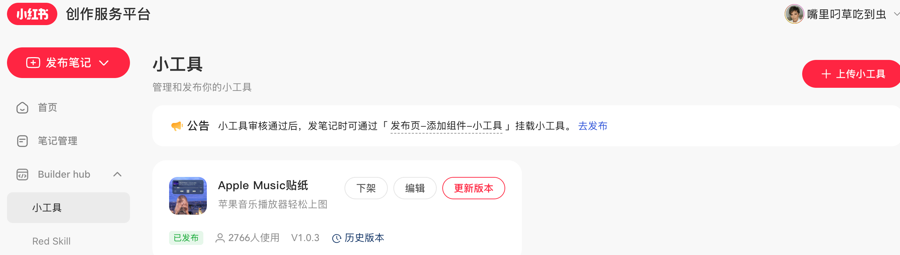
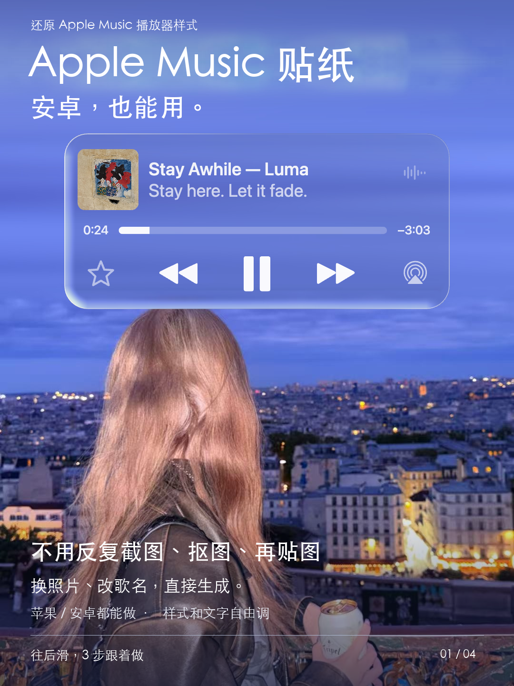
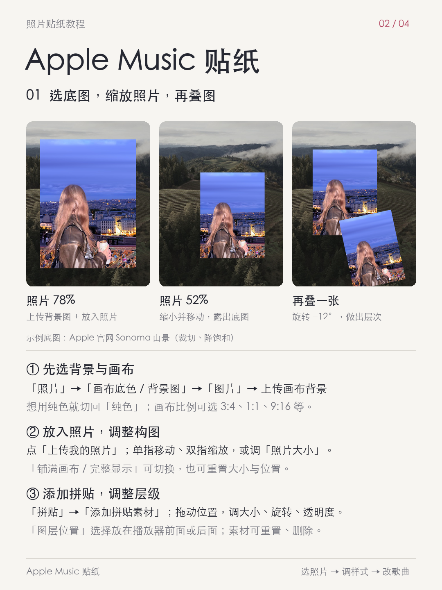
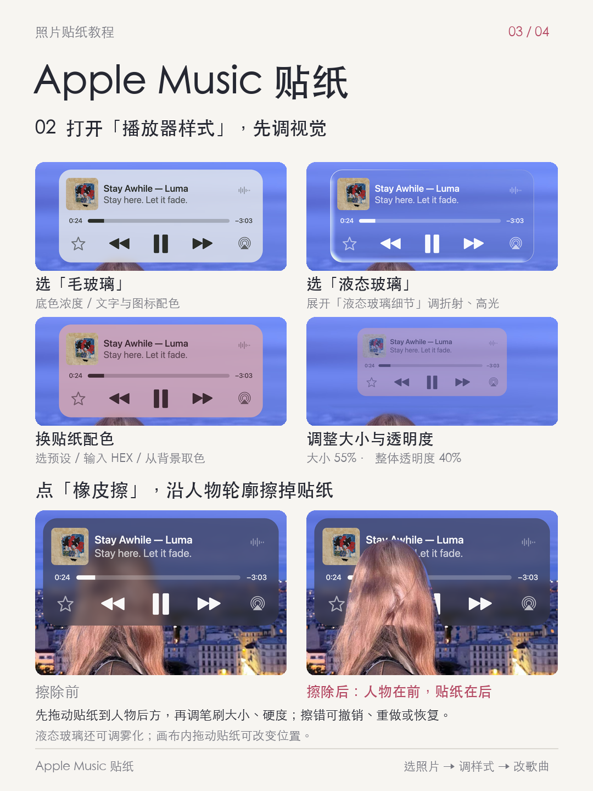
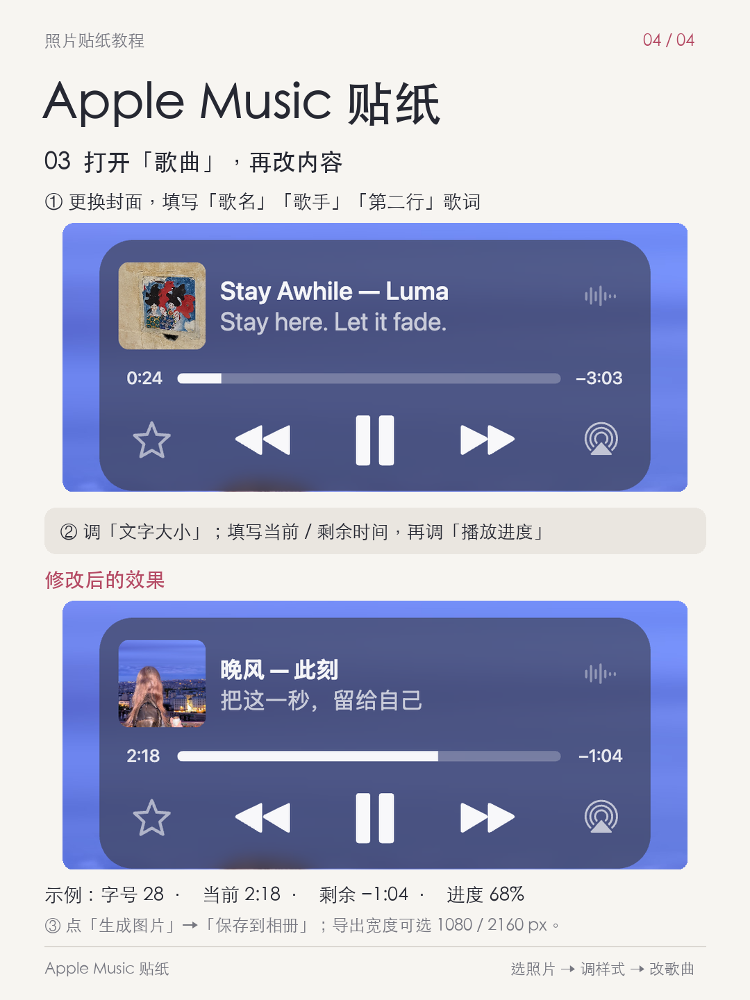

# Apple Music 风格播放器贴纸

> 在线体验：[xingfangxi6.github.io/music-player-sticker](https://xingfangxi6.github.io/music-player-sticker/)
>
> 建议使用手机浏览器打开，上传一张照片即可试用。

一个面向照片编辑场景的静态播放器贴纸工具。它还原 Apple Music 播放器的视觉语言，让 Android 与 iOS 用户都能在浏览器中完成照片、歌词、进度和播放器样式编辑，并导出 PNG 图片。

## 真实使用数据

截至 2026 年 9 月 17 日，小红书创作服务平台后台显示，该小工具已有 **2,766 人使用**。

> 口径说明：这是平台展示的“使用人数”，不等同于下载量、日活、月活或留存数据。



## 为什么做

想在照片里加入 Apple Music 风格的播放器，常见流程是截图、抠图、再导入修图软件调整。这个工具将流程收敛为一个可编辑画布：上传照片、填写歌曲信息、调整贴纸，直接导出成图。

## 核心能力

- 上传照片，单指移动、双指缩放，支持铺满或完整显示。
- 设置画布比例、纯色或图片背景，并支持多图拼贴、旋转、透明度和前后图层。
- 编辑封面、歌名、歌手、歌词、当前时间、剩余时间和播放进度。
- 提供毛玻璃与液态玻璃材质，支持配色、大小、透明度、折射、高光和雾化调整。
- 支持橡皮擦处理人物与播放器的前后遮挡关系，包含撤销、重做与恢复。
- 生成 1080px 或 2160px PNG 静态图片。

## 作品预览

| Apple Music 风格贴纸 | 照片与拼贴 |
| --- | --- |
|  |  |

| 样式与橡皮擦 | 歌曲与导出 |
| --- | --- |
|  |  |

## 使用方式

这是无后端依赖的静态网站。

1. 打开在线体验链接。
2. 在「照片」上传主照片，调整构图或画布背景。
3. 在「播放器样式」选择玻璃材质、颜色和尺寸；需要层次时使用橡皮擦。
4. 在「歌曲」填写封面、文案、时间和进度。
5. 点击「生成图片」保存 PNG。

本项目生成的是静态视觉贴纸，不提供真实音乐播放能力。

## 技术实现

- 原生 HTML / CSS / JavaScript，无框架、无后端。
- Canvas 负责照片、贴纸、拼贴和擦除区域的合成与导出。
- Pointer Events 支持桌面拖拽及移动端单指移动、双指缩放。
- 贴纸材质由 Canvas 绘制与 WebGL 液态玻璃效果组合实现。
- 静态资源均在客户端处理，上传照片不会发送至服务器。

## 本地运行

```bash
python3 -m http.server 8795
```

访问 `http://127.0.0.1:8795`。

## 说明

本项目为非官方的 Apple Music 风格视觉练习与照片编辑工具，与 Apple Inc. 或 Apple Music 无关联、未获其认可。第三方素材与许可证见 [THIRD_PARTY.txt](THIRD_PARTY.txt)。
